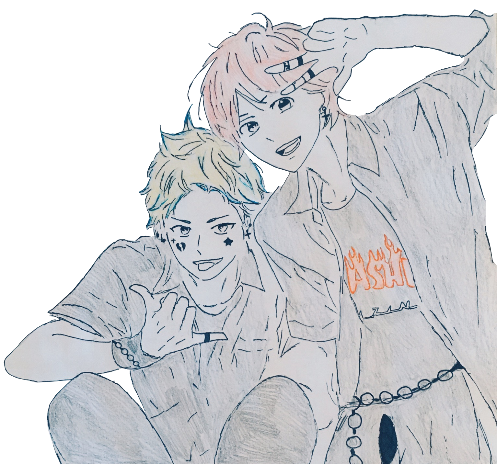

# Sugoi?! An Interactive Fiction Game Made in Twine

Finished:
- [x] Intro arc and practice
- [x] Figure out how to add images
- [x] Drum battle arc

To Do:
- [] Finish dating arcs of..
    - [] Andy
    - [] Avery
    - [] Gabrielle
    - [] Griffin
- [] Add sound
    - background sound 
    - clicking sound effects
    - drumming riffs on click during drum battle
- [] Add more images throughout story
    - [x] Check to see if negative images look better
        - Confirmed that it does indeed look worse
- [] Make Koi move in wave form
- [] Make a group of Koi on screen during bath scene